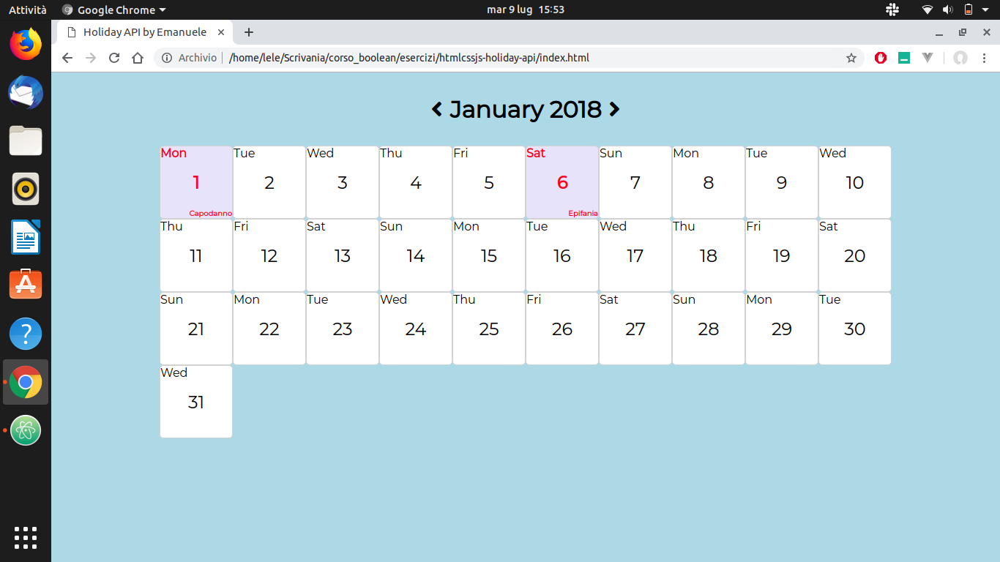
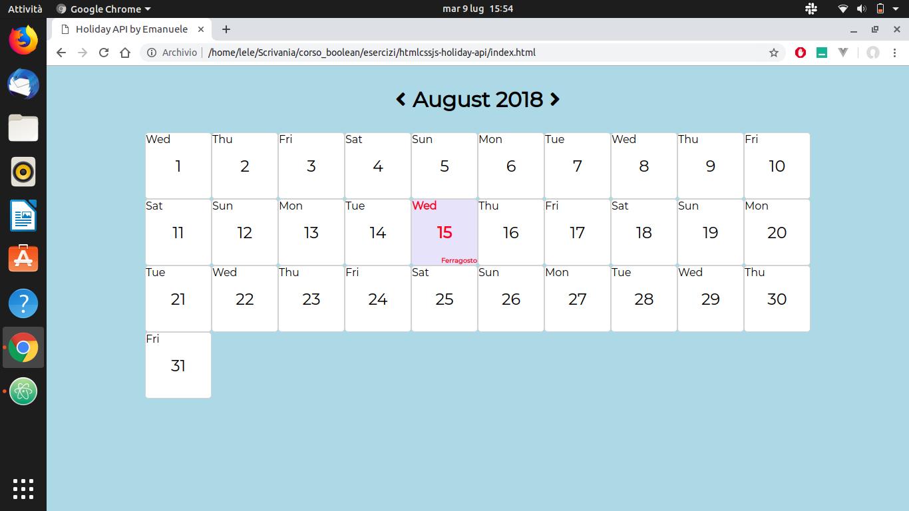

# Holiday API
Applicazione che realizza un calendario dinamico(anno 2018).
 
I mesi dell'anno sono generati dinamicamente tramite Moment.js.
Le festività relative ai vari giorni vengono restituite,tramite AJAX,dall'API https://flynn.boolean.careers/exercises/api/holidays.
## Tecnologie utilizzate
HTML,CSS,Javascript,jQuery,AJAX,Moment.js,Handlebars.js
## Screenshots

  

